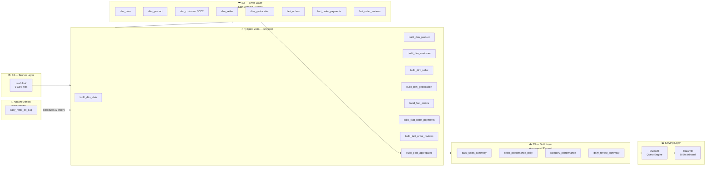

# 🛍️ End-to-End Retail Data Pipeline (ETL / Data Lakehouse)

> **Portfolio Project** — A production-grade Data Engineering pipeline built on the Brazilian E-Commerce Olist dataset.
> Implements Medallion Architecture (Bronze → Silver → Gold), Kimball-style Star Schema, and a Streamlit BI dashboard.


---

## 📌 Project Overview

This project demonstrates an end-to-end Data Engineering workflow — from raw CSV ingestion to an interactive BI dashboard — following industry standards:

- **Medallion Architecture**: Raw (Bronze) → Cleaned/Modeled (Silver) → Aggregated (Gold)
- **Dimensional Modeling**: Kimball-style Star Schema with SCD Type 1 and SCD Type 2
- **Cloud Storage**: AWS S3 as the persistent Data Lake
- **Orchestration**: Apache Airflow DAG with idempotent, date-scoped execution
- **Processing**: PySpark (local mode, S3-connected via `hadoop-aws`)
- **Serving**: DuckDB query engine over Gold Parquet files → Streamlit dashboard

**Dataset**: [Brazilian E-Commerce Public Dataset by Olist](https://www.kaggle.com/datasets/olistbr/brazilian-ecommerce) — 100k+ orders, 2016–2018.

---

## 🏗️ Architecture



---

## 🧰 Tech Stack

| Component         | Tool                      | Purpose                                  |
| ----------------- | ------------------------- | ---------------------------------------- |
| Package Manager   | `uv`                      | Fast Python dependency management        |
| Processing Engine | PySpark 4.2               | Distributed data transformation          |
| Cloud Storage     | AWS S3                    | Medallion Architecture data lake         |
| S3 Connector      | `hadoop-aws 3.5.0`        | Spark ↔ S3 via S3A protocol              |
| Orchestration     | Apache Airflow 2.x        | DAG scheduling, dependency, backfill     |
| Airflow Runtime   | Docker Compose (official) | Local Airflow environment                |
| Query Engine      | DuckDB 1.5                | Fast local Parquet analytics             |
| BI Dashboard      | Streamlit 1.64            | Interactive business dashboard           |
| Data Format       | Parquet + Snappy          | Columnar, compressed, partition-prunable |
| EDA               | JupyterLab                | Data profiling & schema design           |

---

## 📁 Directory Structure

```
project4-aws/
├── airflow/                   # Airflow orchestration environment
│   ├── dags/
│   │   └── daily_retail_etl_dag.py   # Main ETL DAG
│   ├── docker-compose.yaml    # Official Airflow Docker Compose
│   └── .env                   # Airflow env vars (UID, paths)
├── data/                      # Local data lake (mirrors S3 structure)
│   ├── raw/olist/             # Bronze: 9 source CSV files
│   ├── silver/                # Silver: Star Schema Parquet
│   └── gold/                  # Gold: Aggregated metrics Parquet
├── src/
│   ├── jobs/                  # PySpark transformation jobs (9 + gold)
│   │   ├── build_dim_date.py
│   │   ├── build_dim_product.py
│   │   ├── build_dim_customer.py
│   │   ├── build_dim_seller.py
│   │   ├── build_dim_geolocation.py
│   │   ├── build_fact_orders.py
│   │   ├── build_fact_order_payments.py
│   │   ├── build_fact_order_reviews.py
│   │   └── build_gold_aggregates.py
│   └── utils/
│       └── spark_session.py   # SparkSession factory (local + S3A config)
├── dashboard/
│   └── app.py                 # Streamlit BI Dashboard
├── notebooks/
│   └── 01_eda_and_profiling.ipynb
├── tests/
│   ├── test_pipeline_jobs.py  # PySpark job import & schema tests
│   ├── test_gold_outputs.py   # Gold table content validation
│   └── test_dashboard.py      # DuckDB Gold schema tests
├── docs/
│   └── plan.md                # Living design & decision document
├── pyproject.toml             # Project dependencies (uv)
└── README.md
```

---

## 📐 Data Model

### Silver Layer — Kimball Star Schema

| Table                 | Source                             | Grain                         | SCD Strategy                    | Notes                            |
| --------------------- | ---------------------------------- | ----------------------------- | ------------------------------- | -------------------------------- |
| `dim_date`            | Generated                          | date                          | Static                          | Calendar 2016–2018               |
| `dim_product`         | `olist_products_dataset.csv`       | product_id                    | SCD Type 1                      | Includes EN category translation |
| `dim_customer`        | `olist_customers_dataset.csv`      | customer_id + version         | SCD Type 2                      | Tracks city/state history        |
| `dim_seller`          | `olist_sellers_dataset.csv`        | seller_id                     | SCD Type 1                      | Enriched with geolocation        |
| `dim_geolocation`     | `olist_geolocation_dataset.csv`    | zip_code_prefix               | Reference Dim                   | Avg lat/lng per zip              |
| `fact_orders`         | orders + items                     | order_id + order_item_id      | Date-scoped partition overwrite | Core transaction grain           |
| `fact_order_payments` | `olist_order_payments_dataset.csv` | order_id + payment_sequential | Date-scoped partition overwrite | Payment method analytics         |
| `fact_order_reviews`  | `olist_order_reviews_dataset.csv`  | review_id                     | Date-scoped partition overwrite | Customer satisfaction            |

**Job dependency order:**

```
dim_geolocation → dim_seller → dim_customer ─┐
dim_date ──────────────────────────────────────┤→ fact_orders ──┐
dim_product ────────────────────────────────────┘                 ├→ gold_aggregates
                                           fact_order_payments ───┤
                                           fact_order_reviews ────┘
```

### Gold Layer — Business Metrics

| Table                      | Description                | Key Metrics                                       |
| -------------------------- | -------------------------- | ------------------------------------------------- |
| `daily_sales_summary`      | Daily revenue & order KPIs | `gross_revenue`, `order_count`, `avg_order_value` |
| `seller_performance_daily` | Per-seller daily revenue   | `total_revenue`, `order_count`, `state`, `city`   |
| `category_performance`     | Product category ranking   | `total_revenue`, `order_count`, `avg_order_value` |
| `daily_review_summary`     | Daily review score trends  | `avg_review_score`, `review_count`                |

---

## 🚀 Local Quickstart

### Prerequisites

- Python 3.13+
- Java 11 or 17 (required by PySpark)
- [`uv`](https://docs.astral.sh/uv/) installed
- Docker Desktop (for Airflow)

### 1. Install dependencies

```bash
git clone <repo-url>
cd project4-aws
uv sync
```

### 2. Download dataset

Place the 9 Olist CSV files into `data/raw/olist/`:

```
olist_customers_dataset.csv
olist_geolocation_dataset.csv
olist_order_items_dataset.csv
olist_order_payments_dataset.csv
olist_order_reviews_dataset.csv
olist_orders_dataset.csv
olist_products_dataset.csv
olist_sellers_dataset.csv
product_category_name_translation.csv
```

> Download from [Kaggle: Brazilian E-Commerce Dataset](https://www.kaggle.com/datasets/olistbr/brazilian-ecommerce)

### 3. Run a PySpark job (local mode)

Each job accepts `--execution-date`, `--raw-path`, and `--silver-path` arguments:

```bash
uv run python3 src/jobs/build_dim_geolocation.py \
  --execution-date 2017-10-02 \
  --raw-path data/raw/olist \
  --silver-path data/silver
```

Run all jobs in dependency order for a single execution date:

```bash
DATE=2017-10-02
uv run python3 src/jobs/build_dim_geolocation.py --execution-date $DATE --raw-path data/raw/olist --silver-path data/silver
uv run python3 src/jobs/build_dim_date.py --execution-date $DATE --raw-path data/raw/olist --silver-path data/silver
uv run python3 src/jobs/build_dim_product.py --execution-date $DATE --raw-path data/raw/olist --silver-path data/silver
uv run python3 src/jobs/build_dim_customer.py --execution-date $DATE --raw-path data/raw/olist --silver-path data/silver
uv run python3 src/jobs/build_dim_seller.py --execution-date $DATE --raw-path data/raw/olist --silver-path data/silver
uv run python3 src/jobs/build_fact_orders.py --execution-date $DATE --raw-path data/raw/olist --silver-path data/silver
uv run python3 src/jobs/build_fact_order_payments.py --execution-date $DATE --raw-path data/raw/olist --silver-path data/silver
uv run python3 src/jobs/build_fact_order_reviews.py --execution-date $DATE --raw-path data/raw/olist --silver-path data/silver
uv run python3 src/jobs/build_gold_aggregates.py --execution-date $DATE --silver-path data/silver --gold-path data/gold
```

### 4. Launch the dashboard

```bash
uv run streamlit run dashboard/app.py
```

Open [http://localhost:8501](http://localhost:8501) — the dashboard reads Gold Parquet from `data/gold/`.

---

## 🔄 Airflow Local Run (Orchestrated)

Airflow manages job ordering, retries, and backfill automatically.

### Start Airflow

```bash
docker context use desktop-linux
cd airflow
docker compose up -d
```

Open [http://localhost:8080](http://localhost:8080) — login: `airflow` / `airflow`

### Trigger a DAG run

1. Unpause `daily_retail_etl` DAG
2. Click **Trigger DAG w/ config**
3. Set logical date to a date with data, e.g. `2017-10-02`
4. Airflow runs all jobs in dependency order automatically

### Backfill historical data

```bash
docker compose exec airflow-scheduler \
  airflow dags backfill daily_retail_etl \
  --start-date 2016-09-01 \
  --end-date 2018-10-17
```

### Check logs

```bash
docker compose logs --tail=80 airflow-scheduler
```

---

## ☁️ AWS Runbook

### Prerequisites

- AWS CLI configured with a profile (e.g. `project4-aws`)
- IAM permissions: `s3:GetObject`, `s3:PutObject`, `s3:ListBucket` on the target bucket
- Java 11/17 for PySpark S3A connector

### Setup credentials

```bash
export AWS_PROFILE=project4-aws
export AWS_REGION=ap-southeast-1
eval "$(aws configure export-credentials --profile project4-aws --format env)"
```

### Run a job against S3

```bash
BUCKET=s3a://dataengineer-project-aws-olist-retail

PYSPARK_SUBMIT_ARGS="\
--packages org.apache.hadoop:hadoop-aws:3.5.0 \
--conf spark.hadoop.fs.s3a.endpoint=s3.ap-southeast-1.amazonaws.com \
--conf spark.hadoop.fs.s3a.endpoint.region=ap-southeast-1 \
--conf spark.hadoop.fs.s3a.path.style.access=false \
--conf spark.hadoop.fs.s3a.input.stream.type=classic \
pyspark-shell" \
uv run python3 src/jobs/build_dim_geolocation.py \
  --execution-date 2017-10-02 \
  --raw-path $BUCKET/raw/olist \
  --silver-path $BUCKET/silver
```

### Verify output on S3

```bash
aws s3 ls s3://dataengineer-project-aws-olist-retail/silver/ --recursive --human-readable
aws s3 ls s3://dataengineer-project-aws-olist-retail/gold/ --recursive --human-readable
```

### S3 bucket structure

```
s3://dataengineer-project-aws-olist-retail/
├── raw/olist/                  ← 9 source CSVs (immutable Bronze)
├── silver/
│   ├── dim_date/
│   ├── dim_product/
│   ├── dim_customer/
│   ├── dim_seller/
│   ├── dim_geolocation/
│   ├── fact_orders/
│   ├── fact_order_payments/
│   └── fact_order_reviews/
└── gold/
    ├── daily_sales_summary/
    ├── seller_performance_daily/
    ├── category_performance/
    └── daily_review_summary/
```

> ⚠️ AWS credentials are **never** stored in source code, `.env` files committed to git, or this README. Use AWS CLI profiles locally and IAM roles for compute.

---

## 🧪 Running Tests

```bash
# All tests
uv run python3 -m pytest tests/ -v

# Unit tests: job imports & module structure
uv run python3 -m pytest tests/test_pipeline_jobs.py -v

# Integration tests: Gold table content validation
uv run python3 -m pytest tests/test_gold_outputs.py -v

# Dashboard layer: DuckDB Gold schema tests
uv run python3 -m pytest tests/test_dashboard.py -v
```

---

## ⚠️ Known Limitations

| Limitation                         | Detail                                                                                                                                                   |
| ---------------------------------- | -------------------------------------------------------------------------------------------------------------------------------------------------------- |
| **Local Spark only**               | PySpark runs in `local[*]` mode. No EMR or Glue cluster — sufficient for portfolio but not production-scale throughput.                                  |
| **Date-scoped fact tables**        | `fact_orders` processes one execution date at a time. Full historical data requires backfill across all dates in the dataset.                            |
| **Small Gold rows per single run** | Running for a single date (e.g. `2017-10-02`) produces 1-row Gold summaries. Full Gold data requires backfill across the full dataset.                   |
| **Dashboard reads local Gold**     | `dashboard/app.py` reads from `data/gold/` by default. Connecting directly to S3 Gold requires DuckDB `httpfs` extension + AWS credential passthrough.   |
| **No real-time streaming**         | Pipeline is batch-only. CDC, Kafka, and streaming are out of scope.                                                                                      |
| **Airflow local, not managed**     | Airflow runs via Docker Compose locally. MWAA (Managed Airflow) is out of scope.                                                                         |
| **Static dataset**                 | Olist is a historical dataset (2016–2018), not a live feed. `schedule=None` in Airflow DAG; schedule activation requires a live incremental data source. |

---

## 📄 License

This project is for portfolio and educational purposes. Dataset credit: [Olist](https://olist.com/) via Kaggle.
